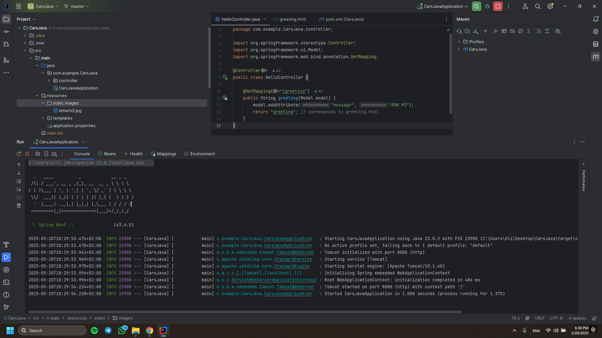
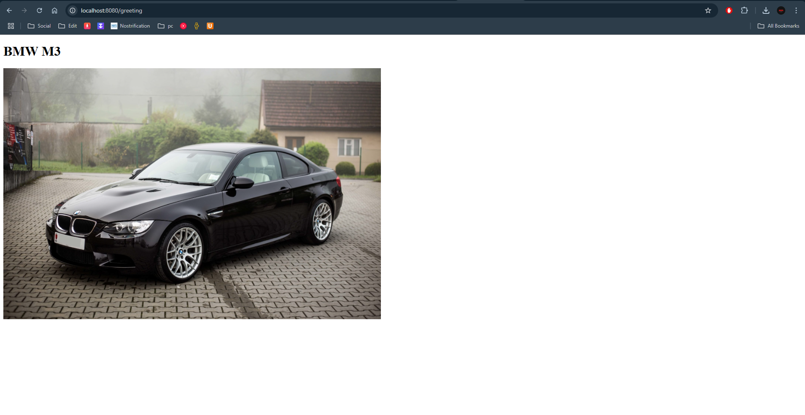

I've created a Spring Boot project using Spring Initializr, built a simple controller that handles HTTP requests, returned a plain text and HTML view using Thymeleaf, and tested the application locally in the browser.

